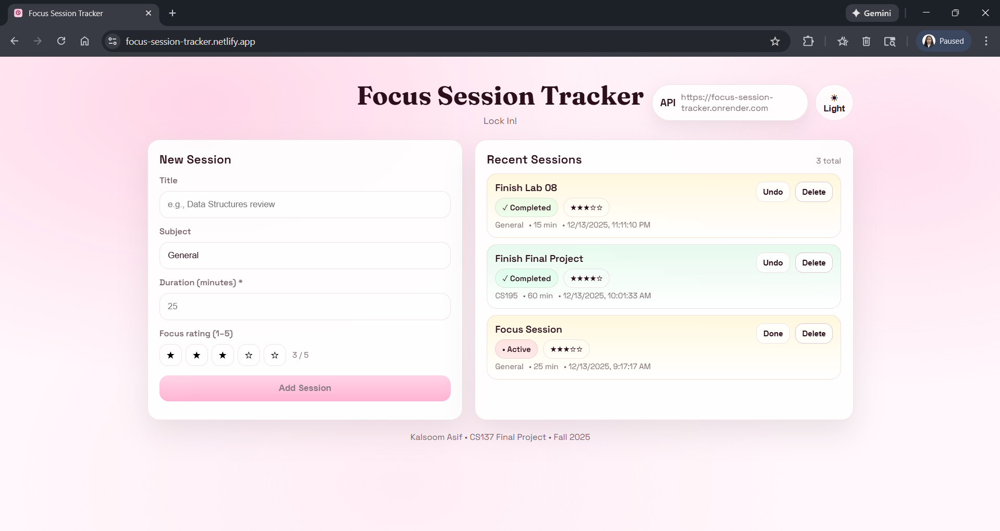

📘 Focus Session Tracker

A full-stack productivity app that helps students log, track, and reflect on focused study sessions.

🚀 Overview  

What my application does:   
Focus Session Tracker allows users to create, view, complete, and delete focused study sessions, each with a subject, duration, and self-rated focus score.

Who it’s for?: 
This app is designed for students who want a simple way to track study habits and stay accountable during focused work time.

The core problem it solves: 
Many students struggle to manage and reflect on their study time. This app provides a lightweight system to log focus sessions and persist them for later review.

🌐 Live Demo  
Type	Link  
Frontend (Deployed Site)	https://focus-session-tracker.netlify.app  
Backend (API Base URL)	https://focus-session-tracker.onrender.com  

✨ Features  
List 3–6 key features, ideally with short bullets:

- Create, view, and delete focus sessions

- Assign subject, duration, and focus rating to each session

- Mark sessions as completed or undo completion

- Persistent data storage using MongoDB Atlas

- Responsive React UI with reusable components

- Backend REST API with full CRUD functionality 

Advanced Feature:   
The advanced feature implemented is the ability to mark focus sessions as completed or undo completion. This updates both the database and UI state in real time using API calls and React state management.

📸 Screenshots:  

🏗️ Project Architecture  
Describe how the pieces fit together:

/frontend
/src
/components
App.jsx
main.jsx

/backend
/models
/routes
server.js

Include a sentence explaining the flow:

The React frontend communicates with the Express backend through API routes. The backend interacts with MongoDB using Mongoose models, and environment variables are used to store secrets.

🛠 API Documentation:

Documented below are the main backend API routes used by the application.

GET /sessions  
Returns all focus sessions stored in the database.

POST /sessions  
Creates a new focus session.

PATCH /sessions/:id  
Updates an existing focus session (e.g., marking it as completed or undoing completion).

DELETE /sessions/:id  
Delete a focus session by ID.

🚀 Deployment Notes

Frontend:
- Deployed using Netlify  
- The frontend is built automatically using the default Vite build process  
- Environment variables are configured in Netlify, including `VITE_API_URL` to point to the deployed backend  

Backend: 
- Deployed using Render as a Node.js web service  
- The backend connects to MongoDB Atlas using a `MONGO_URI` environment variable  
- Additional environment variables (such as `PORT`) are configured in the Render dashboard  
- CORS is configured to allow requests from the Netlify frontend

📦 Installation & Setup

Follow the steps below to run the project locally.

1. Clone the repository
git clone https://github.com/your-username/focus-session-tracker.git
cd focus-session-tracker

2. Install dependencies

Frontend:
cd frontend
npm install
npm run dev

Backend:
cd backend
npm install
npm run dev

The backend will run on http://localhost:4000
The frontend will run on http://localhost:5173

Make sure the backend is running before starting the frontend so API requests work correctly.

🔐 Environment Variables

This project uses environment variables to store sensitive configuration values.

Create a .env file in both the frontend and backend directories.
Example files are shown below.

Backend .env.example
MONGO_URI=your_mongodb_connection_string
PORT=4000

Frontend .env.example
VITE_API_URL=http://localhost:4000

Environment variables are excluded from version control and configured separately for deployment on Netlify and Render.

🧰 Tech Stack

Frontend:
- React
- Vite
- JavaScript
- CSS

Backend:
- Node.js
- Express

Database:
- MongoDB Atlas
- Mongoose

Deployment:
- Netlify (Frontend)
- Render (Backend)

🧠 Reflection:

1. What was the hardest part of this project?

The hardest part of this project was debugging the connection between the deployed frontend and backend. Even when both deployments were live, the app initially failed to create new sessions due to a frontend form handler issue, which was not immediately obvious from error messages. Tracing the problem required careful use of browser DevTools, network requests, and console logs to isolate whether the issue was frontend logic, CORS, or backend routing. This process helped me better understand how small React wiring issues can completely block functionality in a full-stack app.

2. What are you most proud of?

I am most proud of successfully deploying a fully functional MERN application where the frontend and backend communicate correctly in production. Getting CRUD operations working end-to-end, especially after resolving deployment and CORS issues, was a big milestone for me. I am also proud of how clean and responsive the UI turned out, and how session data persists correctly after refresh. Overall, this project gave me confidence in debugging real-world full-stack issues.

3. What would you do differently next time?

Next time, I would spend more time testing core functionality locally before deploying to production. I would also break the project into smaller milestones with clearer checkpoints for frontend logic, backend routes, and deployment. This would help catch issues like broken form handlers earlier in development. Additionally, I would document API behavior sooner to make debugging faster later.

4. How did you incorporate feedback from the 12/5 check-in gallery?

Based on feedback from the check-in gallery, I reduced the scope of the project by focusing on stabilizing core CRUD functionality instead of adding new features. I prioritized making sure sessions could be reliably created, displayed, updated, and persisted across refreshes. I also cleaned up component structure and improved UI clarity after receiving feedback about usability and layout. This feedback helped me focus on correctness and polish rather than feature overload.